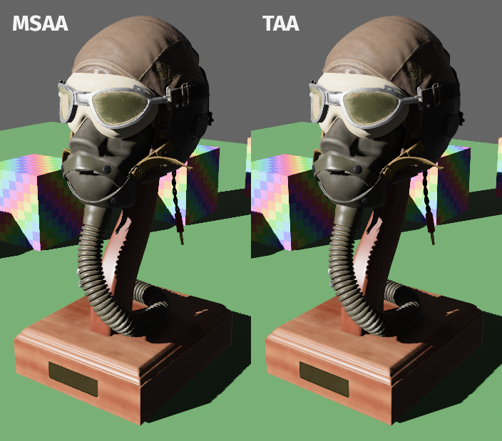

+++
title = "Bevy 0.11"
date = 2023-07-07
[extra]
author = "Bevy Contributors"
+++

Thanks to **X** contributors, **X** pull requests, community reviewers, and our [**generous sponsors**](/community/donate), we're happy to announce the **Bevy 0.11** release on [crates.io](https://crates.io/crates/bevy)!

For those who don't know, Bevy is a refreshingly simple data-driven game engine built in Rust. You can check out our [Quick Start Guide](/learn/book/getting-started/) to try it today. It's free and open source forever! You can grab the full [source code](https://github.com/bevyengine/bevy) on GitHub. Check out [Bevy Assets](https://bevyengine.org/assets) for a collection of community-developed plugins, games, and learning resources.

To update an existing Bevy App or Plugin to **Bevy 0.11**, check out our [0.10 to 0.11 Migration Guide](/learn/migration-guides/0.10-0.11/).

Since our last release a few months ago we've added a _ton_ of new features, bug fixes, and quality of life tweaks, but here are some of the highlights:

<!-- more -->

* **Feature**: description

## Temporal Antialiasing

authors: @JMS55, @DGriffin91

Alongside MSAA and FXAA, Bevy now supports Temporal Anti-aliasing (TAA) as an anti-aliasing option.

TAA works by blending the newly rendered frame with past frames in order to smooth out aliasing artifacts in the image. TAA has become increasingly popular in the industry because of its ability to cover up so many rendering artifacts: it smooths out shadows (both global illumination and "casted" shadows), mesh edges, textures, and reduces specular aliasing of light on reflective surfaces. However because the "smoothing" effect is so apparent, some people prefer other methods.

Here's a quick rundown of the following advantages and disadvantages of each anti-aliasing method that Bevy supports:

* **Multi-Sample Antialiasing (MSAA)**
  * Does a good job at smoothing the edges of meshes (anti geometric aliasing). Does not help with specular aliasing. Performance cost scales with triangle count, and performs very poorly on scenes with many triangles
* **Fast Approximate Antialiasing (FXAA)**
  * Does a decent job of dealing with both geometric and specular aliasing. Very little performance cost in all scenes. Somewhat blurry and low quality results
* **Temporal Antialiasing (TAA)**
  * Does a very good job at dealing with both geometric and specular aliasing. Does a good job at dealing with temporal aliasing, where high-frequency details flicker over time or as you move the camera around or as things animate. Performance cost is moderate, and scales only with screen resolution. Chance of "ghosting" where meshes or lighting effects may leave trails behind them that fade over time. Although TAA helps with reducing temporal aliasing, it may also introduce additional temporal aliasing, especially on thin geometry or texture detail rendered at a distance. Requires 2 view's worth of additional GPU memory, as well as enabling the motion vector and depth prepasses. Requires accurate motion vector and depth prepasses, which complicates custom materials

TAA implementations are a series of tradeoffs and rely on heuristics that are easy to get wrong. In Bevy 0.11, TAA is marked as an experimental feature for the following reasons:

* TAA does not currently work with the following Bevy features: skinning, morph targets, and parallax mapping
* TAA currently tends to soften the image a bit, which can be worked around via post-process sharpening
* Our TAA heuristics are not currently user-configurable (and these heuristics are likely to change and evolve)

We will continue to improve quality, compatibility, and performance in future releases. Please report any bugs you encounter!

You can compare all of our anti-aliasing methods in Bevy's improved [anti-aliasing example](https://github.com/bevyengine/bevy/blob/v0.11.0/examples/3d/anti_aliasing.rs).

## What's Next?

* **X**: Y

Check out the [**Bevy 0.12 Milestone**](https://github.com/bevyengine/bevy/milestone/14) for an up-to-date list of current work being considered for **Bevy 0.12**.

## Support Bevy

Sponsorships help make our work on Bevy sustainable. If you believe in Bevy's mission, consider [sponsoring us](/community/donate) ... every bit helps!

<a class="button button--pink header__cta" href="/community/donate">Donate </a>

## Contributors

Bevy is made by a [large group of people](/community/people/). A huge thanks to the X contributors that made this release (and associated docs) possible! In random order:

* @author
